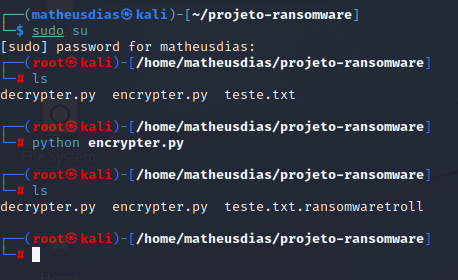
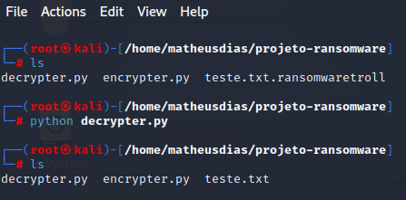
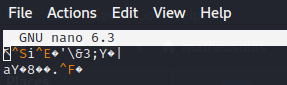
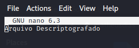

# Criando um Ransomware com Python
Objetivo é implementar um Ransomware para criptografar e descriptografar arquivos utilizando a linguagem Python

### Ferramentas utilizadas:

- __Kali Linux__ (https://www.kali.org/)
- __Linguagem Python__ (https://www.python.org/)
- __NANO__ (https://linuxize.com/post/how-to-use-nano-text-editor/)

### Estrutura :
- __Arquivo encrypter.py:__ código que irá criptografar os arquivos
- __Arquivo decrypter.py:__ código que irá descriptografar os arquivos previamente criptografado


### Pontos Importantes:
 - Caso apresente algum erro no terminal, deverá instalar a biblioteca: ``` pyaes ```.

       - sudo apt-get update && sudo apt-get upgrade

       - sudo apt install python3-pyaes

### Resumo:

 - Acesso o Terminal Emulator (CMD)
 - Iniciar NANO: nano
 - Construir o código para abrir o arquivo criptografado
 - Construir o código para chave de descriptografar
 - Construir o código para remover o arquivo criptografado
 - Construir o código para criar o arquivo descriptografado

### Detalhamento:

Terminal - Criptografando o arquivo:


Terminal - Descriptografando o arquivo



### Resultado

``` Arquivo Criptografado ```



``` Arquivo Descriptografado ```




